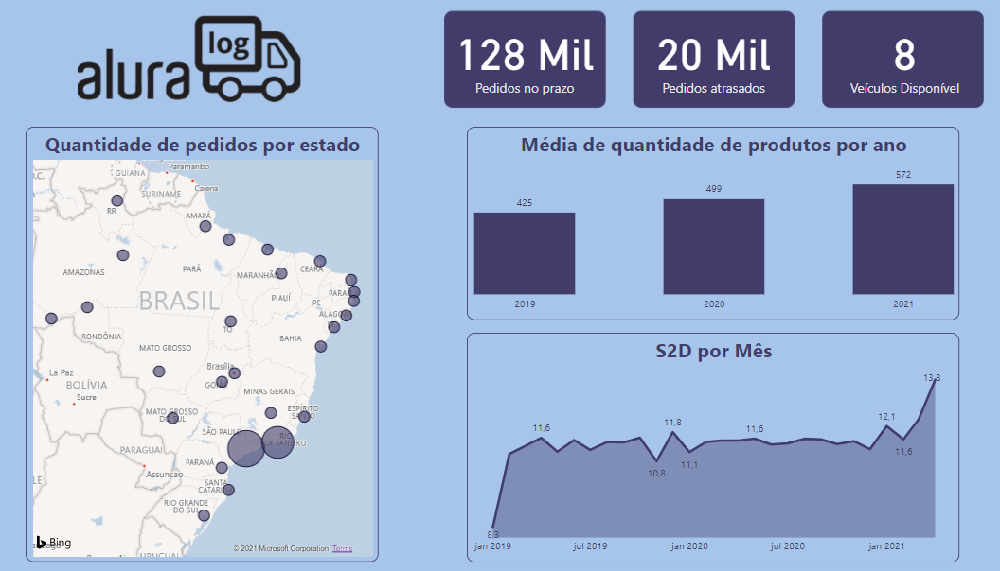

<h1>Challenge de BI Alura - 1ª Semana</h1>

<h2>Estudo de caso: dashboard de logística</h2>
 
    
Descrição:

    
A pessoa que gerencia a área de logística da Alura Log, está enfrentando algumas mudanças em sua área por conta do aumento da demanda dos serviços de logística no período da pandemia. Ela quer manter a qualidade de seu serviço, mas para isso precisa acompanhar constantemente as métricas do seu departamento para tomar as melhores decisões. Quando nos contou isso, analisamos que para auxiliar nesse desafio precisaremos fazer um dashboard para logística. Para isso, vamos visualizar algumas métricas muito importantes para a área.

 

<h2>Ferramenta utilizada</h2>
    
Para o desenvolvimento do estudo de caso, foi utilizado o software Power BI para o desenvolvimento de Dashboard e a ferramenta figma para criar plano de fundo do dashboard.

 

<h2>Bases de dados</h2>
O nosso cliente disponibilizou 4 bases de dados sobre logística no formato CSV sendo essas bases:
<ul>    
    <li>tabela pedidos - contém o registro de todos os pedidos feitos pelos clientes.
    <li>tabela produtos - contém os produtos cadastrados e seus valores.
    <li>tabela veículos - contém veículos registrados que fazem o transporte dos produtos
    <li>tabela estoque - contém o registro de estoque dos produtos por mês
</ul>
 
<h2>Questões do estudo de caso</h2>
    <ol>
        <li>Visualizar quantas entregas foram feitas no prazo.
        <li>Visualizar quantas entregas foram feitas atrasadas.
        <li>Mostrar número de veículos disponíveis.
        <li>Mostrar a quantidade de pedidos por estado.
        <li>Calcular o Ship to door, expedição até a entrega, medido em dias.
        <li>Visualizar o nível médio de estoque por ano.
    </ol>
 
<h2>Resultado</h2>
    
Acesse o dashboard pelo <a href="https://app.powerbi.com/view?r=eyJrIjoiNTIwZjk3NTEtNGRlYS00YmM2LWIxYjMtMTIxZDM3YjRmMDVhIiwidCI6IjIyMWNkOWNjLTZmYTctNDEyNi05NjY2LTRjMGViYWY3ZDk4MyJ9&pageName=ReportSection" target="_blank">link</a>

    </a>

